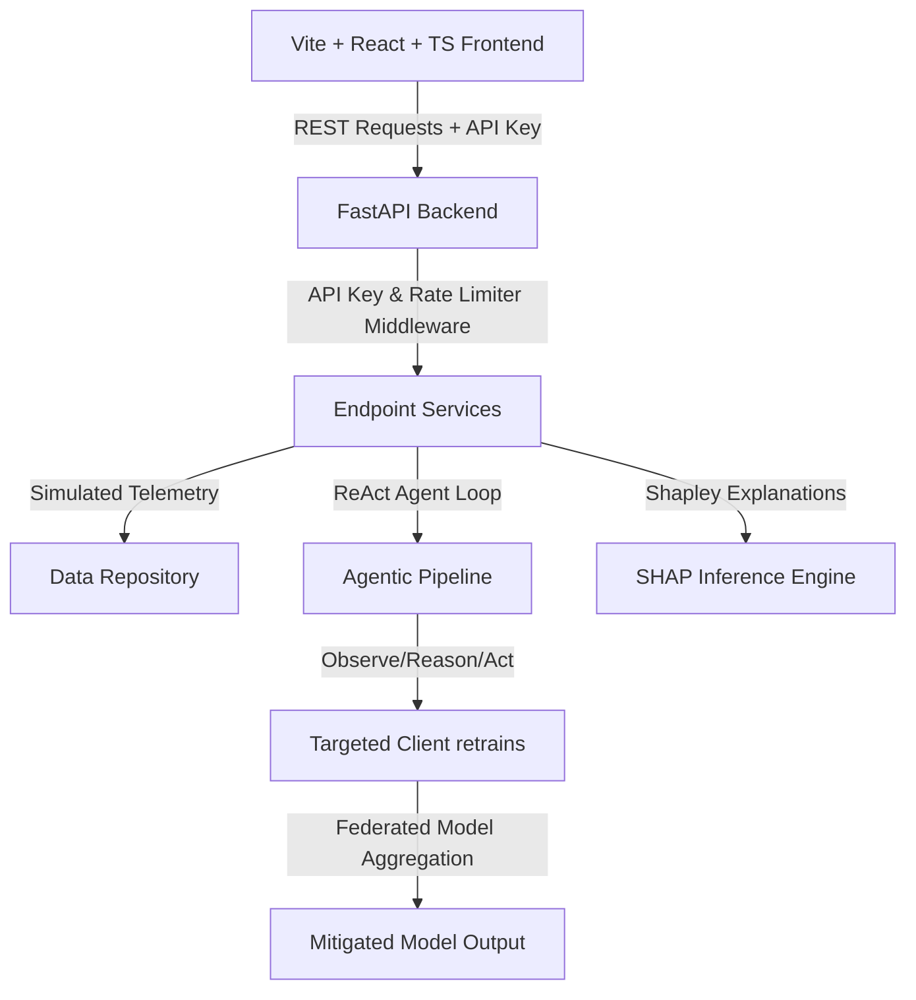

# Aerova (FAXAQ) - Autonomous Environmental Risk Calibration

### 🚀 Live Deployment Links
*   **Live Web Dashboard**: [https://aerova-prasunethon-2-0-hackathon.vercel.app](https://aerova-prasunethon-2-0-hackathon.vercel.app)
*   **Production REST API**: [https://aerova-prasunethon-2-0-hackathon1.onrender.com](https://aerova-prasunethon-2-0-hackathon1.onrender.com)

---

Aerova is a premium full-stack web application designed and validated for **Prasunethon 2.0 Round 2**. It demonstrates an autonomous, self-healing federated learning pipeline designed to monitor and mitigate environmental model data drift (non-stationarity) in smart city grids.

---

## 🏗️ Architecture Design



### 6-Layer Stack
1.  **Frontend Presentation Layer**: Built with React, TypeScript, and Vite. Animations are driven by Framer Motion, telemetry forecasts are rendered with Recharts, and draggable widgets allow citizen-centric dashboard customization.
2.  **API Routing & Security Layer**: FastAPI endpoints guarded with API-key headers and SlowAPI rate-limiting.
3.  **Data Core Layer**: In-memory data store holding historical and active zone readings seeded from the research benchmarks.
4.  **Machine Learning Layer**: Base models training on non-IID urban environments (Zone A, B, C) with standard coefficients.
5.  **Agentic AI Layer (ReAct)**: A self-governing pipeline where agents (Monitor, Orchestrator, Alert, Policy) collaborate to detect drift (residuals > 25.0), dispatch public alerts, and coordinate updates.
6.  **Federated Learning & Explainability Layer**: Weight aggregation cycles merging local gradients to maintain privacy, combined with local Shapley value attributions for citizen risk profiles.

---

## 🚀 How to Run Locally

### 1. Prerequisites
Ensure you have **Node.js** (v24+) and **uv** (or Python 3.11+) installed.

### 2. Start the Backend API
1.  Navigate to the project root:
    ```bash
    cd "c:/Users/chris/OneDrive/Documents/AEROVA FAXAQ"
    ```
2.  Create virtual environment and install requirements:
    ```bash
    uv venv
    uv pip install -r backend/requirements.txt
    ```
3.  Launch the FastAPI server:
    ```bash
    .venv\Scripts\uvicorn.exe backend.main:app --port 8000 --reload
    ```
    *The API will start at http://localhost:8000*

### 3. Start the Frontend
1.  In a separate terminal window, navigate to the project root.
2.  Install packages:
    ```bash
    npm install
    ```
3.  Launch the Vite dev server:
    ```bash
    npm run dev
    ```
    *The frontend will start at http://localhost:5173*

---

## 📊 Mapping to FAXAQ Research Benchmarks

Every performance stat and parameter mapped in this UI reflects exact figures from the original **FAXAQ synthetic benchmark validation**:
*   **Data Drift residual threshold**: `25.0`
*   **Mean Residual under drift**: `44.5`
*   **Static baseline model accuracy under drift**: `35.9%`
*   **Aerova (Agentic Federated Calibration) recovered accuracy**: `77.4%`
*   **Centralized baseline accuracy (no-drift conditions)**: `82.5%`
*   **Federated baseline accuracy (no-drift conditions)**: `82.6%`
*   **Citizen risk coefficients**: Asthma Child (`0.566`), Healthy Adult (`0.206`), Elderly Cardio (`0.526`).

### Production vs. Simulation Mapping
*   **Sensor Telemetry**: *Simulated* in backend memory with non-IID offsets. In production, this maps to hardware IoT sensors via MQTT/Kafka brokers.
*   **ReAct Loop Execution**: *Simulated* algorithmically via predefined logical agents on FastAPI. In production, these agents utilize LLMs (e.g., Gemini Flash) in a structured tool-use loop.
*   **Model Retraining**: *Simulated* calibration cycles. In production, PySyft or Flower manages the client gradient uploads and TensorFlow/PyTorch handles the local backward passes.
